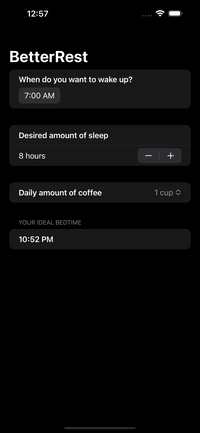

# BetterRest
 Sleep duration prediction using machine learning based on the cups of coffee you've drank!    
 
# Installation
 1. Open up Xcode
 2. Click on File > Open
 3. Select BetterRest.xcodeproj
 4. Press Command+R to Build and Run
# Training the Model
 There is a trained model included named SleepCalculator.mlmodel but in case you want to train your own model using different techniques:
 1. Open up Xcode
 2. Click on Xcode > Open Developer Tool > Create ML
 3. Press New Document
 4. Select Tabular Regression
 5. Select BetterRest.csv as the training data
 6. Choose estimatedSleep as the Target
 7. Choose the features (recommended: all features) and the algorithm (recommended: Automatic) you want to run
 8. Press Train
 9. From Output press Get to save the model
 10. Add it to your project
 
